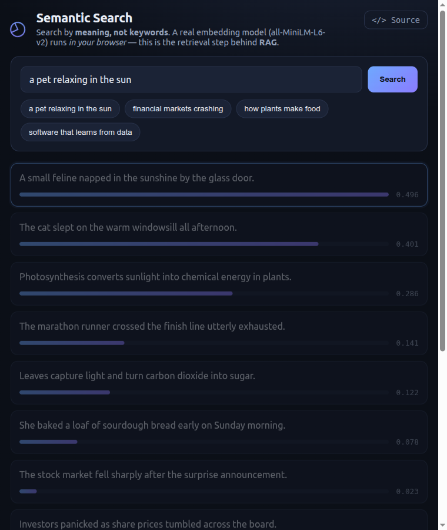

# Semantic Search (in-browser embeddings)

Search a small text corpus by **meaning, not keywords** — a real sentence-embedding model runs **entirely in your browser**. This is the *retrieval* step that powers **RAG** (Retrieval-Augmented Generation).

> **Live demo:** https://tongchen2010.github.io/assets/demos/semantic-search-rag.html



---

## What it shows

Type a query like *"a pet relaxing in the sun"* and it ranks the corpus by semantic similarity — surfacing *"A small feline napped in the sunshine"* even though it shares **no words** with the query. That's the difference between embedding-based search and keyword search, and it's exactly how a RAG pipeline finds relevant context to feed an LLM.

Each result shows its cosine-similarity score and a bar relative to the best match.

## How it works

1. [🤗 Transformers.js](https://github.com/huggingface/transformers.js) loads **all-MiniLM-L6-v2** (a 384-dim sentence encoder, ~23 MB) from the Hugging Face CDN — **once**, then cached.
2. The corpus is embedded locally into normalized vectors.
3. Your query is embedded the same way; results are ranked by **cosine similarity** (a dot product of normalized vectors).

Everything — model and inference — runs in the browser (WebAssembly, or WebGPU when available). No server, no API key, no data leaves your device.

## Run locally

```bash
python3 -m http.server 8000
# open http://localhost:8000/
```

## Note

The first load downloads the model (~23 MB); afterward it's instant from cache. Best on a modern desktop browser.

## License

MIT © Tong Chen
